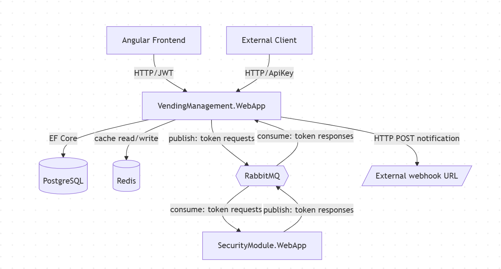
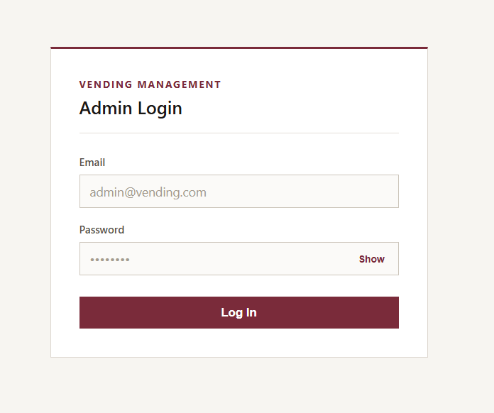
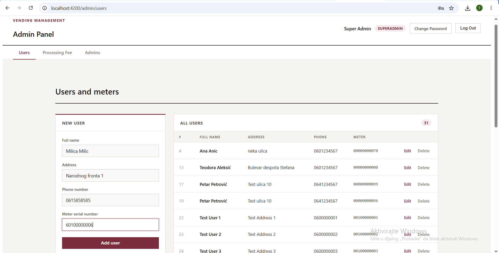
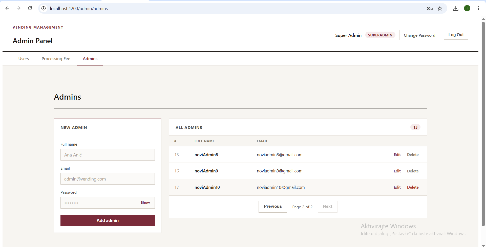
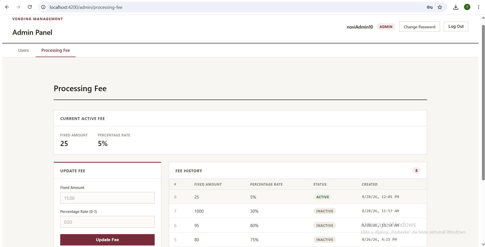
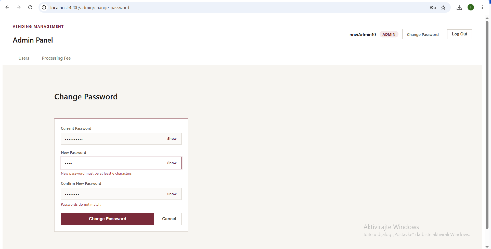
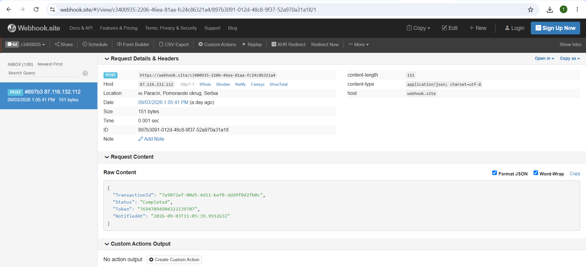

# Vending Management System

A prepaid token purchase system for smart electricity meters. Customers pay
an amount through an API, the system deducts a processing fee, and a
prepaid energy token is generated and delivered back to the customer.

## What the application does

- **Customers** each own exactly one smart meter (identified by an 11 or
  13-digit serial number). A customer submits a payment amount and
  receives back a name/address/phone confirmation, the generated token,
  the resulting energy amount, and the processing fee charged.
- **Processing fee** is calculated as `FixedAmount + (Amount * PercentageRate)`.
  Only one fee configuration is active at a time; changing it logically
  retires the old one and adds a new one, so historical transactions keep
  the fee that was actually applied to them.
- **Admins** manage customers and the processing fee configuration through
  a web-based admin panel. A **super admin** additionally manages other
  admin accounts.
- **Token generation** is handled by a separate Security Module service.
  Because that service can only process one request at a time and has an
  unstable connection, token requests are queued (RabbitMQ) instead of
  processed synchronously — the customer gets an immediate "accepted"
  response and the token is delivered asynchronously.
- **Notifications**: customers can register a webhook URL to be notified
  the moment their transaction completes, or poll the transaction status
  endpoint themselves.

## Architecture

- **VendingManagement.WebApp / BLL / DAL / Shared** — the main system,
  split into a Web API layer, business logic layer, data access layer
  (Repository + Unit of Work over EF Core), and a shared layer of DTOs
  and constants used across services.
- **SecurityModule.WebApp / BLL** — the separate token-generation service,
  communicating with the main system exclusively through RabbitMQ.
- **PostgreSQL** — persistent storage.
- **Redis** — caches the active processing fee (Cache-Aside pattern with
  TTL and invalidation on change), since it's read on every transaction
  but changes rarely.
- **RabbitMQ** — decouples the main system from the Security Module in
  both directions: token requests go out on one queue, generated tokens
  come back on another, so neither service blocks waiting on the other.
- **Angular frontend** — the admin panel (login, customer management,
  processing fee management, admin management for super admins).
  
## Logging

Structured logging is handled with Serilog. Every request and significant
business event (transaction processing, cache hits/misses, RabbitMQ
publish/consume, webhook delivery, errors) is logged to both the console
and rolling daily log files (`Logs/log-.txt`, retained for 7 days), making
it straightforward to trace a transaction's full lifecycle across the
queue-based flow.

## Admin panel (Angular)

Available after logging in at `http://localhost:4200`:

- **Login** — JWT-based authentication, roles: `Admin` and `SuperAdmin`.
- **Users tab** — paginated list of customers; create, edit, and
  (soft-)delete customers, each with a linked meter.
- **Processing Fee tab** — view the currently active fee, update it, and
  see the full history of past fee configurations.
- **Admins tab** (SuperAdmin only) — paginated list of admin accounts;
  create, edit, and (soft-)delete admins.
- **Change Password** — available to any logged-in admin, for their own account.

## Customer-facing API (tested via Postman, ApiKey-authenticated)

These endpoints are meant for an external client (e.g. a mobile app or a
smart meter integration), not the admin panel, and require an `x-api-key`
header identifying the customer:

- `POST /api/transaction/buy-token` — submit a serial number and amount;
  returns immediately with `202 Accepted` and a transaction ID while the
  token is generated in the background.
- `GET /api/transaction/{id}` — poll a transaction by its public ID to
  check whether it's still pending, completed (with the token), or failed.
- `PUT /api/transaction/webhook-url` — set or update the URL that should
  be called automatically when this customer's transaction completes.

## Screenshots

### Login

### Users management

### Admins management

### Processing fee history

### Change password

### Webhook notification received

## Running the application

### Requirements

Docker Desktop installed and running.

### Steps

1. Clone this repository

2. Navigate into the project folder

3. Start the application:

docker compose -f docker-compose.prod.yml up -d

4. Open the application at:

http://localhost:4200

The database is automatically migrated and seeded with sample data on
first run; no manual setup is required.

If you want to stop the application, you can do:
docker compose -f docker-compose.prod.yml down
